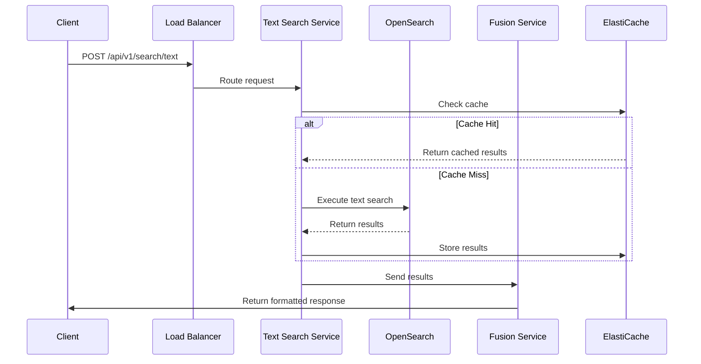
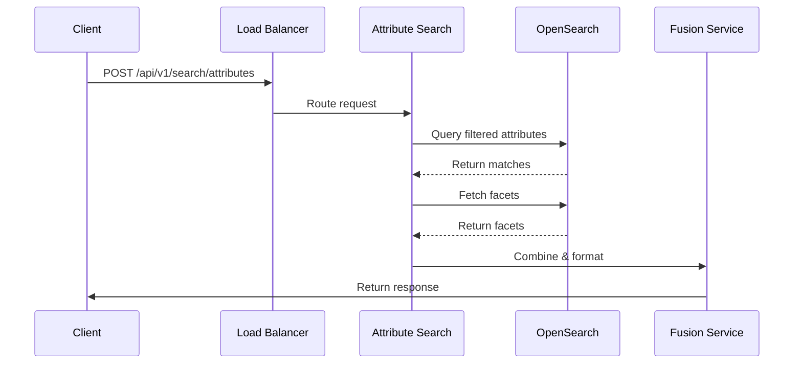
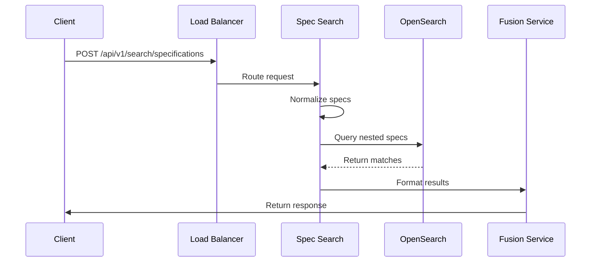
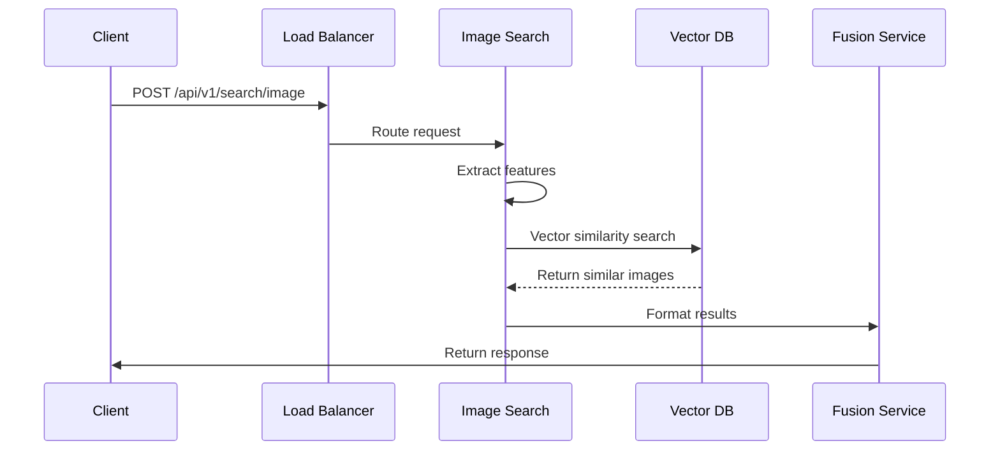
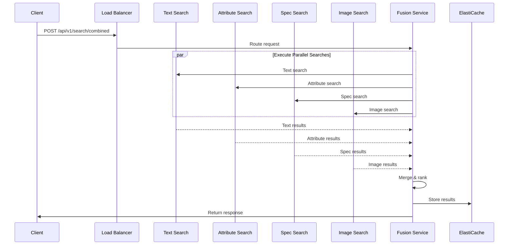

# Search Query Flow Documentation

## System Architecture Overview


## Component Details

### 1. Data Sources Layer
- **ERP System**: Source of product inventory, pricing, and basic product information
- **CRM System**: Customer data, purchase history, and product interactions
- **S3 Raw Files**: Raw product data files, including specifications and descriptions
- **Product Images**: Source repository for product images and visual content

### 2. Image Processing Pipeline
- **Amazon Rekognition**
  - Processes product images using custom-trained models
  - Extracts visual features and labels
  - Generates feature vectors for similarity search

- **Feature Extraction**
  - Label Detection: Identifies product characteristics and attributes
  - Feature Vector: Generates numerical representations for image similarity
  - Technical Specs Extraction: Extracts text and metadata from product images

### 3. Data Processing Layer
- **Schema Processing**
  - Core Schema: Base product information schema
  - Category Schema: Category-specific attributes
  - Sub-Category Schema: Detailed product specifications

- **Lambda Functions**
  - Schema Merger: Combines different schema types
  - Image Merger: Integrates processed image data with product information

### 4. Storage & Search Layer
- **Storage Solutions**
  - S3 Clean Zone: Processed and validated data storage
  - OpenSearch: Primary search engine for text and structured data
  - Vector DB: Specialized database for image feature vectors

- **Index Management**
  - Primary Index: Main product search index
  - Image Search Index: Specialized index for image similarity
  - Field Mappings: Structured mapping of all product attributes

## 1. Text Search Flow


### Text Search Process
1. **Query Reception**
   - Client sends text search query with parameters
   - ALB validates request and routes to Text Search Service

2. **Cache Check**
   - Generate cache key from query parameters
   - Check ElastiCache for existing results
   - If found, return cached results

3. **Search Execution**
   - Build OpenSearch query DSL:
     ```json
     {
       "multi_match": {
         "query": "user_query",
         "fields": ["title^3", "description^2", "brand^1"],
         "type": "best_fields",
         "fuzziness": "AUTO"
       }
     }
     ```
   - Execute search against OpenSearch cluster
   - Process and score results

4. **Result Processing**
   - Apply relevance scoring
   - Format results according to API schema
   - Cache results for future queries

## 2. Attribute Search Flow


### Attribute Search Process
1. **Filter Processing**
   - Parse attribute filters
   - Build attribute query:
     ```json
     {
       "bool": {
         "must": [
           {"terms": {"brand": ["value1", "value2"]}},
           {"range": {"price": {"gte": 100, "lte": 500}}}
         ]
       }
     }
     ```

2. **Facet Generation**
   - Calculate facets for filtered results
   - Apply post-filtering aggregations
   - Generate facet counts

3. **Result Aggregation**
   - Combine filtered results with facets
   - Apply sort criteria
   - Format response

## 3. Specification Search Flow


### Specification Search Process
1. **Specification Normalization**
   - Standardize units and values
   - Convert ranges to normalized format
   - Build nested query:
     ```json
     {
       "nested": {
         "path": "specifications",
         "query": {
           "bool": {
             "must": [
               {"match": {"specifications.name": "cpu"}},
               {"terms": {"specifications.value": ["i7", "i9"]}}
             ]
           }
         }
       }
     }
     ```

2. **Query Execution**
   - Execute nested queries
   - Apply technical filters
   - Score based on specification matches

## 4. Image Search Flow


### Image Search Process
1. **Feature Processing**
   - Extract image features or use provided vector
   - Normalize feature vector
   - Prepare similarity search:
     ```json
     {
       "vector": [0.1, 0.2, ...],
       "k": 10,
       "similarity": "cosine"
     }
     ```

2. **Similarity Search**
   - Execute vector similarity search
   - Calculate similarity scores
   - Rank results by similarity

## 5. Combined Search Flow


### Combined Search Process
1. **Query Distribution**
   - Parse combined query parameters
   - Distribute to appropriate services
   - Execute searches in parallel

2. **Result Fusion**
   - Weight results from each service
   - Merge overlapping results
   - Calculate combined scores:
     ```python
     def combine_scores(results):
         combined = {}
         weights = {
             'text': 0.4,
             'attribute': 0.3,
             'spec': 0.2,
             'image': 0.1
         }
         
         for service, items in results.items():
             for item in items:
                 if item.id not in combined:
                     combined[item.id] = {
                         'score': 0,
                         'matches': []
                     }
                 combined[item.id]['score'] += item.score * weights[service]
                 combined[item.id]['matches'].append(service)
         
         return sorted(combined.items(), key=lambda x: x[1]['score'], reverse=True)
     ```

3. **Response Generation**
   - Format combined results
   - Include relevance explanations
   - Cache final response