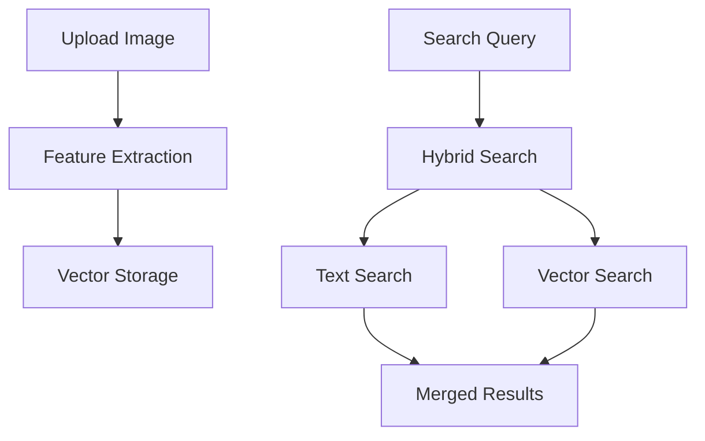

# Multi-tenant Industrial Equipment Search System

A scalable, multi-tenant search system for industrial equipment with marketplace integration and smart recommendations.

## Table of Contents
- [Architecture Overview](#architecture-overview)
- [Tenancy Strategies](#tenancy-strategies)
- [Data Storage Patterns](#data-storage-patterns)
- [Search Capabilities](#search-capabilities)
- [Marketplace Integration](#marketplace-integration)
- [Future Enhancements](#future-enhancements)
- [Performance Optimization](#performance-optimization)
- [Security Considerations](#security-considerations)

## Architecture Overview

The system is built on a modern cloud-native architecture supporting multiple tenants with isolated data access and shared marketplace capabilities.

graph TD
    subgraph Client Layer
        WA[Web Application]
        MA[Mobile App]
    end

    subgraph AWS Cloud
        subgraph Load Balancing & Security
            CF[CloudFront]
            WAF[AWS WAF]
            ALB[Application Load Balancer]
        end

        subgraph Application Layer
            ECS[ECS/Fargate Cluster]
            subgraph Services
                AS[Authentication Service]
                SS[Search Service]
                TS[Tenant Service]
                IS[Indexing Service]
            end
        end

        subgraph Data Processing
            SQS[SQS Queue]
            Lambda[Lambda Functions]
            Comprehend[Amazon Comprehend]
        end

        subgraph Storage & Data
            ES[Amazon OpenSearch]
            Aurora[Aurora PostgreSQL]
            S3[S3 Buckets]
            ElastiCache[ElastiCache Redis]
        end

        subgraph Monitoring & Management
            CW[CloudWatch]
            XRay[X-Ray]
            SNS[SNS]
        end
    end

    %% Client connections
    WA --> CF
    MA --> CF
    CF --> WAF
    WAF --> ALB

    %% Application routing
    ALB --> ECS
    ECS --> AS
    ECS --> SS
    ECS --> TS
    ECS --> IS

    %% Data flow
    SS --> ES
    SS --> ElastiCache
    TS --> Aurora
    IS --> SQS
    SQS --> Lambda
    Lambda --> Comprehend
    Lambda --> ES
    IS --> S3

    %% Monitoring
    ECS --> CW
    ECS --> XRay
    CW --> SNS

### Core Components
- **Search Engine**: OpenSearch/Elasticsearch cluster
- **Data Processing**: Python-based NLP pipeline
- **API Layer**: FastAPI/Flask REST endpoints
- **Caching**: Redis/ElastiCache
- **Storage**: S3 for binary data, RDS for metadata

### Tech Stack
- Python 3.9+
- Elasticsearch/OpenSearch 7.x+
- Sentence Transformers for NLP
- spaCy for text processing
- AWS Services (OpenSearch, S3, Lambda)

## Tenancy Strategies

### 1. Index-per-Tenant
```python
tenant1_index = "tenant1_equipment"
tenant2_index = "tenant2_equipment"
```

**Pros**:
- Complete isolation
- Flexible index settings per tenant
- Easy backup/restore per tenant

**Cons**:
- Resource overhead
- Limited scalability
- Complex management

### 2. Shared Index (Recommended)
```python
{
    "tenant_id": "uuid",
    "equipment_data": { ... }
}
```

**Pros**:
- Better resource utilization
- Simpler management
- More cost-effective
- Better for small to medium tenants

**Cons**:
- Careful query design needed
- Potential for large tenant impact

### 3. Hybrid Approach
```python
# Large tenants get dedicated indices
dedicated_indices = ["large_tenant_1", "large_tenant_2"]
# Small tenants share indices
shared_index = "shared_equipment_index"
```

**Pros**:
- Balanced approach
- Handles varying tenant sizes
- Cost-effective

**Cons**:
- More complex routing logic
- Higher operational complexity

## Data Storage Patterns

### Document Structure
```json
{
    "tenant_id": "uuid",
    "metadata": {
        "visibility": "private|marketplace",
        "created_at": "timestamp",
        "updated_at": "timestamp"
    },
    "equipment": {
        "name": "string",
        "category": "string",
        "specifications": [
            {
                "parameter": "string",
                "value": "number",
                "unit": "string"
            }
        ]
    }
}
```

### Sharding Strategies

1. **Tenant-based Sharding**
```python
shard_num = hash(tenant_id) % num_shards
```

2. **Time-based Sharding**
```python
index_name = f"equipment-{year}-{month}"
```

## Search Capabilities

### Current Features
1. Natural Language Processing
   - Entity recognition
   - Specification parsing
   - Unit conversion

2. Smart Filtering
   - Category matching
   - Specification range matching
   - Location-based search

3. Marketplace Integration
   - Cross-tenant search
   - Relevance scoring
   - Smart suggestions

### Future Enhancements

#### 1. Image Search Integration
```python
class ImageSearchPipeline:
    def __init__(self):
        self.image_encoder = ImageEncoder()  # ResNet/EfficientNet
        self.vector_store = VectorStore()    # FAISS/Milvus
        
    def process_image(self, image_data: bytes) -> Dict:
        # Extract features
        features = self.image_encoder.encode(image_data)
        # Store vectors
        vector_id = self.vector_store.add(features)
        return {
            "vector_id": vector_id,
            "metadata": self.extract_metadata(image_data)
        }
```

##### Image Search Architecture
1. **Feature Extraction**
   - ResNet/EfficientNet for embeddings
   - Equipment-specific feature detection
   - Metadata extraction (size, color, text)

2. **Vector Storage**
   - FAISS/Milvus for vector search
   - Hybrid search combining text and images
   - Tenant-aware vector indexing

3. **Search Workflow**


#### 2. Real-time Analytics
- Equipment availability tracking
- Price trend analysis
- Marketplace demand metrics

## Performance Optimization

### Caching Strategy
```python
class SearchCache:
    def __init__(self, redis_client):
        self.redis = redis_client
        self.ttl = 3600  # 1 hour
        
    def get_cached_search(self, tenant_id: str, query_hash: str):
        cache_key = f"{tenant_id}:search:{query_hash}"
        return self.redis.get(cache_key)
```

### Query Optimization
1. Field Data Caching
2. Custom Routing
3. Search Template Usage

## Security Considerations

### Data Isolation
```python
def ensure_tenant_isolation(tenant_id: str, query: Dict) -> Dict:
    """Add tenant isolation to every query"""
    return {
        "bool": {
            "must": [
                {"term": {"tenant_id": tenant_id}},
                query
            ]
        }
    }
```

### Access Control
1. Tenant-level permissions
2. User-level access control
3. Marketplace visibility rules

### Audit Logging
```python
def log_search_event(tenant_id: str, query: Dict, results_count: int):
    """Log search events for audit"""
    event = {
        "timestamp": datetime.utcnow(),
        "tenant_id": tenant_id,
        "query": query,
        "results_count": results_count
    }
    audit_logger.info(event)
```