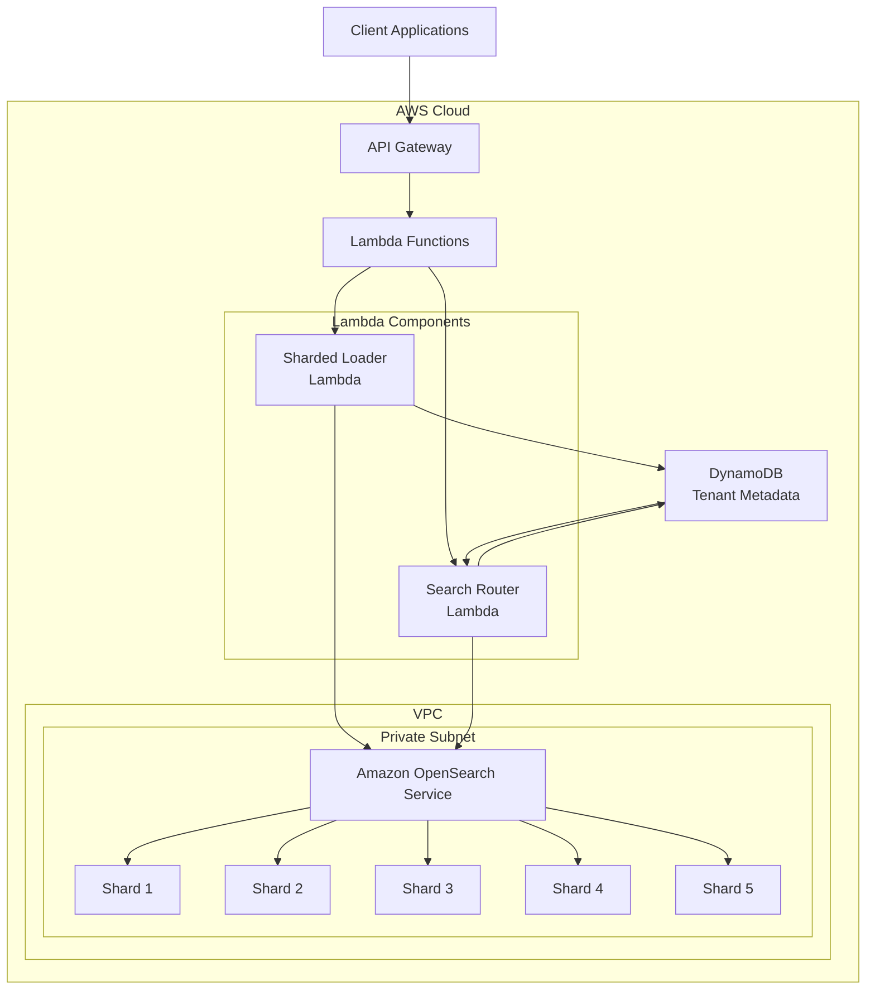
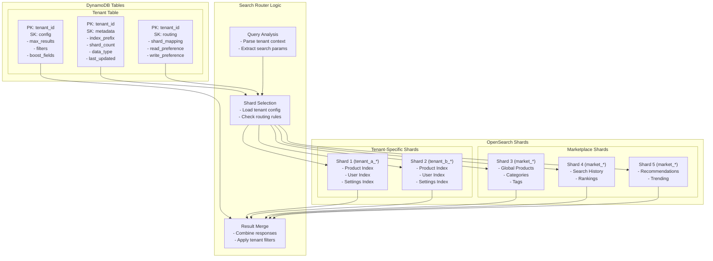

```mermaid
graph TD
    subgraph "AWS Cloud"
        subgraph "VPC"
            subgraph "Private Subnet"
                OS[Amazon OpenSearch Service]
                OS1[Shard 1]
                OS2[Shard 2]
                OS3[Shard 3]
                OS4[Shard 4]
                OS5[Shard 5]
                OS --> OS1
                OS --> OS2
                OS --> OS3
                OS --> OS4
                OS --> OS5
            end
        end

        API[API Gateway]
        LF[Lambda Functions]
        DDB[DynamoDB<br/>Tenant Metadata]
        
        subgraph "Lambda Components"
            L1[Sharded Loader<br/>Lambda]
            L2[Search Router<br/>Lambda]
        end

        API --> LF
        LF --> L1
        LF --> L2
        L1 --> DDB
        L2 --> DDB
        L1 --> OS
        L2 --> OS
        DDB --> L2
    end

    Client[Client Applications]
    Client --> API
```

A detailed overview of this would look like 

```mermaid
graph TD
    subgraph "DynamoDB Tables"
        subgraph "Tenant Table"
            T1[PK: tenant_id<br/>SK: metadata<br/>- index_prefix<br/>- shard_count<br/>- data_type<br/>- last_updated]
            T2[PK: tenant_id<br/>SK: routing<br/>- shard_mapping<br/>- read_preference<br/>- write_preference]
            T3[PK: tenant_id<br/>SK: config<br/>- max_results<br/>- filters<br/>- boost_fields]
        end
    end

    subgraph "OpenSearch Shards"
        subgraph "Tenant-Specific Shards"
            S1["Shard 1 (tenant_a_*)
                - Product Index
                - User Index
                - Settings Index"]
            S2["Shard 2 (tenant_b_*)
                - Product Index
                - User Index
                - Settings Index"]
        end

        subgraph "Marketplace Shards"
            S3["Shard 3 (market_*)
                - Global Products
                - Categories
                - Tags"]
            S4["Shard 4 (market_*)
                - Search History
                - Rankings"]
            S5["Shard 5 (market_*)
                - Recommendations
                - Trending"]
        end
    end

    subgraph "Search Router Logic"
        R1["Query Analysis
            - Parse tenant context
            - Extract search params"]
        R2["Shard Selection
            - Load tenant config
            - Check routing rules"]
        R3["Result Merge
            - Combine responses
            - Apply tenant filters"]
    end

    T1 --> R2
    T2 --> R2
    T3 --> R3
    R1 --> R2
    R2 --> S1
    R2 --> S2
    R2 --> S3
    R2 --> S4
    R2 --> S5
    S1 --> R3
    S2 --> R3
    S3 --> R3
    S4 --> R3
    S5 --> R3
```