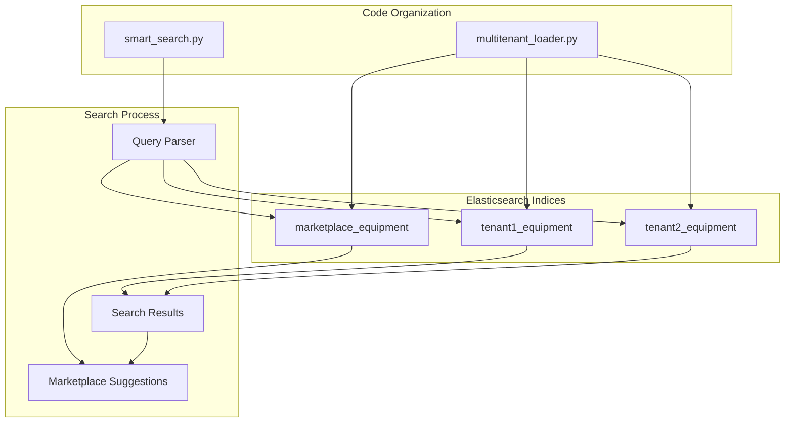

```mermaid
graph TD
    subgraph Code Organization
        ML[multitenant_loader.py]
        SS[smart_search.py]
    end

    subgraph Elasticsearch Indices
        T1[tenant1_equipment]
        T2[tenant2_equipment]
        MP[marketplace_equipment]
    end

    subgraph Search Process
        QP[Query Parser]
        SR[Search Results]
        MS[Marketplace Suggestions]
    end

    ML --> T1
    ML --> T2
    ML --> MP
    
    SS --> QP
    QP --> T1
    QP --> T2
    QP --> MP
    T1 --> SR
    T2 --> SR
    MP --> MS
    SR --> MS
```